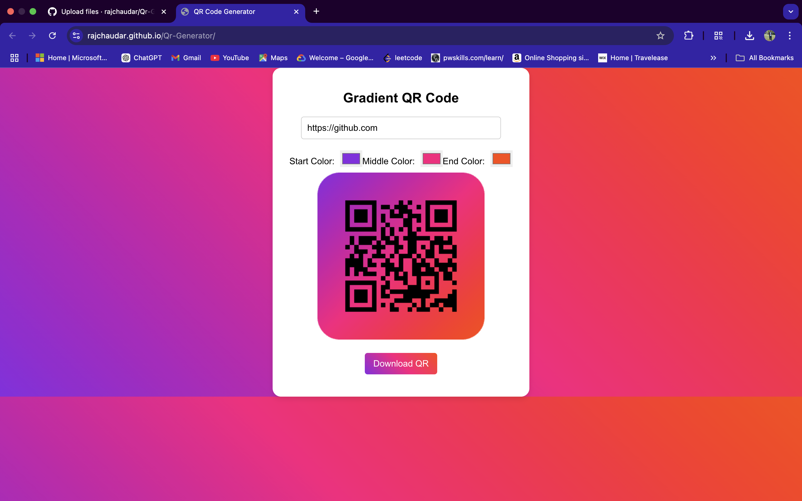

# Web Live On 

[QR Code Generator](https://rajchaudar.github.io/Qr-Generator)


# QR Code Generator

A simple and stylish QR Code Generator built using React. This application allows users to generate QR codes with a customized background, rounded corners, and gradient colors.

## Features
- Generate QR codes from text input.
- Custom styling with a gradient background and rounded corners.
- Uses HTML5 Canvas for rendering the QR code.
- Real-time preview of the generated QR code.
- Downloadable QR code image.

## Technologies Used
- React.js
- HTML5 Canvas API
- QR Code Library (e.g., `qrcode.react`)
- CSS for styling

## Installation

1. Clone the repository:
   ```sh
   git clone https://github.com/yourusername/qr-code-generator.git
   cd qr-code-generator
   ```

2. Install dependencies:
   ```sh
   npm install
   ```

3. Start the development server:
   ```sh
   npm start
   ```

## Usage
1. Enter text or a URL in the input field.
2. Click the "Generate QR Code" button.
3. View the generated QR code with a custom background.
4. Download the QR code as an image.

## Screenshot


## Future Enhancements
- Allow users to customize colors and styles.
- Add support for different QR code sizes.
- Implement an option to add a logo in the QR code center.

## Contributing
Feel free to fork this repository and submit pull requests with improvements.

## License
This project is licensed under the MIT License.

---

### Author
**Shivraj Chaudar**

[GitHub Profile](https://github.com/rajchaudar)

